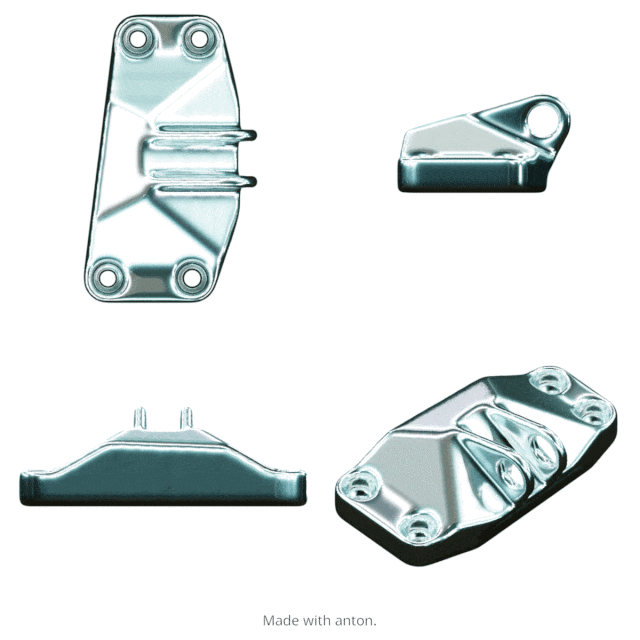

{:width="600px"}

I'm a Research Engineer at the [Neurobionics Lab](https://neurobionics.robotics.umich.edu), Department of Robotics, University of Michigan. Currently, I am working on the design and development of the [Open-source Leg](https://opensourceleg.com). My primary interests include **bio-inspired design and mechanisms**, **generative design**, **open-source prosthetic devices**, and **community-driven development**. This site serves as a container to all of my undergraduate work.
