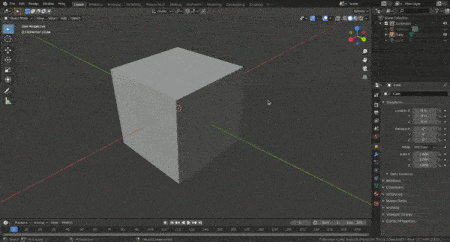
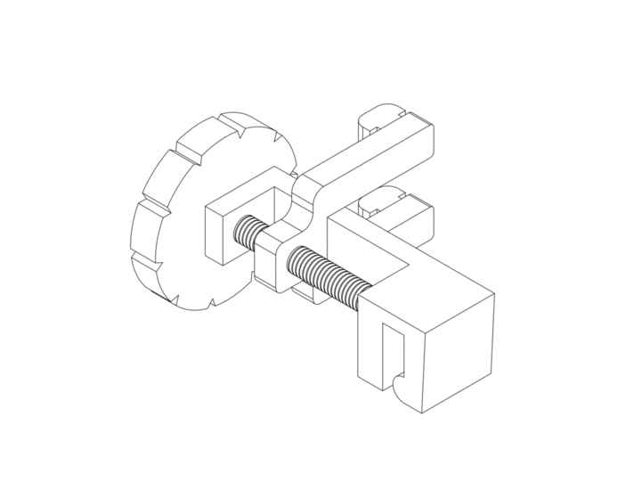
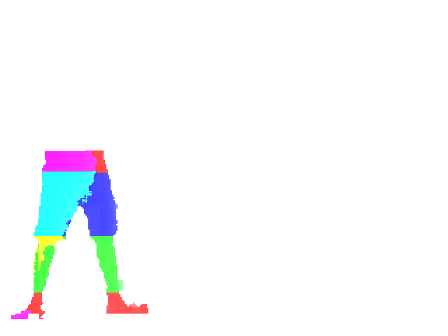

| [{:width="600px"}](https://github.com/blender-for-science/blendmsh){:target="blank"} **Blendmsh**: Blendmsh is a bridge between Blender 2.80+ and Gmsh, a fast and light 3D finite element mesh generator.

| {:target="blank"} **Spec-Shield**: Spec-Shield is a curvature adjustable face shield that tackles undesirable reflections and can be mounted on spectacles..|  (*Under Development*) An open-source image dataset of human gait at different walking speeds labelled with joint parameters.|  

| {:target="blank"} **uw_dynamics**:  Unlike underwater vehicles such as ROVs and AUVs, these robots are propelled by fluid-structure interaction which are relatively hard to simulate compared to thrusters/propellers (as found in ROVs and AUVs). The proposed project aims at developing a gazebo package containing plugins capable of simulating such robots. It can also be extended to simulate biomimetic robots in fluids of various densities and even aerial biomimetic robots.