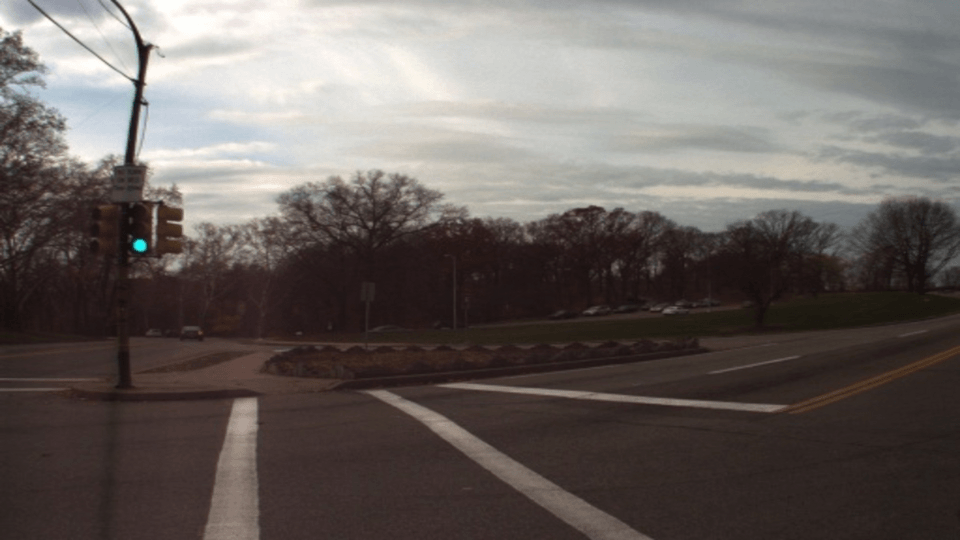
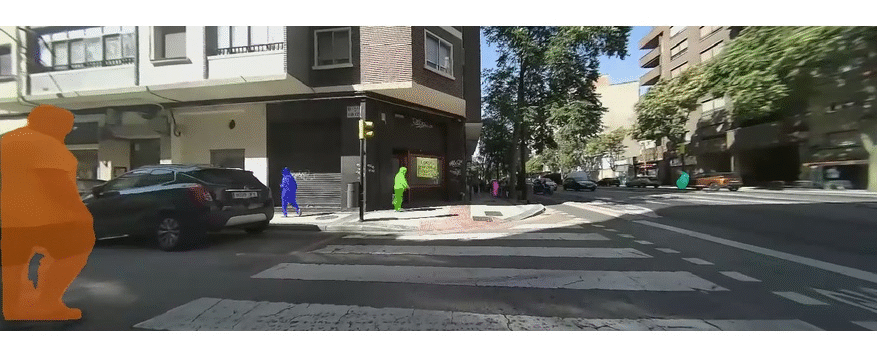
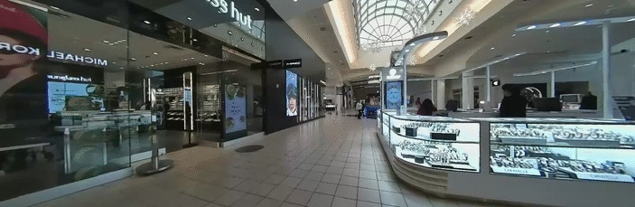
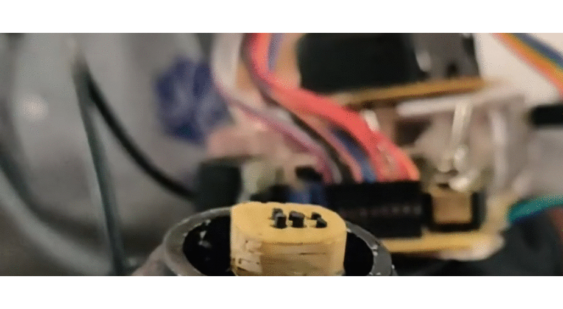

 **[Visual Localization](#){:target="_blank"}**: This project explores the use of camera systems to interpret scenes through context clues, enabling the creation of a lightweight internal map and facilitating localization of the camera system. In an autonomous delivery robot setting, context clues are learned from diverse data gathered during repeated traversals of the area of interest.
  

---

 **[Adverse Weather Perception](#){:target="_blank"}**: Traditional computer vision algorithms often struggle in adverse weather conditions due to insufficient training samples for such environments. To address this without requiring retraining, a preprocessing step is essential to mitigate the effects of adverse weather. From a robotic perception perspective, this step must operate in real-time and enhance the performance of subsequent algorithms, such as object detection and segmentation.
  

---

 **[Human Segmentation and Face Pose Estimation](#){:target="_blank"}**: Segmenting humans and estimating face pose has significant implications for robotics. Human segmentation aids in estimating tracking vectors, allowing robots to navigate more effectively among people. Face pose estimation helps detect gaze direction, enhancing interaction and enabling the quantification of ad views displayed on the robot.
  

---

 **[Occupancy Estimation from Mocular Depth](#){:target="_blank"}**: State-of-the-art monocular depth estimation models excel at producing relative depth maps. Robots typically use cameras with overlapping views and and have reference points at a fixed distance such as parts of their own structure. Integrating this data with camera intrinsics allowed to transform a 360-degree camera into a LiDAR system with a denser point cloud.
  

---

 **[Sim2Real for Robotic Task Learning](#){:target="_blank"}**: This project introduces T-Net, a GAN architecture designed to optimize task learning on real images using synthetic images and their corresponding task-specific labels, along with unlabeled real images. Drawing inspiration from CycleGAN, T-Net employs a consistency loss that ensures the generated images are realistic while maintaining alignment with the labels of the synthetic data.
  

---

 **[Portable Braille](#){:target="_blank"}**: This project explores the use of low-cost microactuators like solenoids from obsolete dot matrix printer heads, to create a refreshable Braille display capable of simulating 10 characters at a time. Incorporating a camera to convert text from the surrounding environment and feeding this information to the actuators in real time significantly enhances Braille accessibility for low-income users.
  

---

 **[Mocking Bot](#){:target="_blank"}**: Have you ever heard a piece of music and wanted to play it? This project, which secured first place at EYantra 2018 hosted by IIT Bombay, focuses on understanding and replicating musical instruments. This bot is designed to listen to music, extracting key elements such as note onsets, note types, and the specific instrument being played and mimic it using robotic arms.