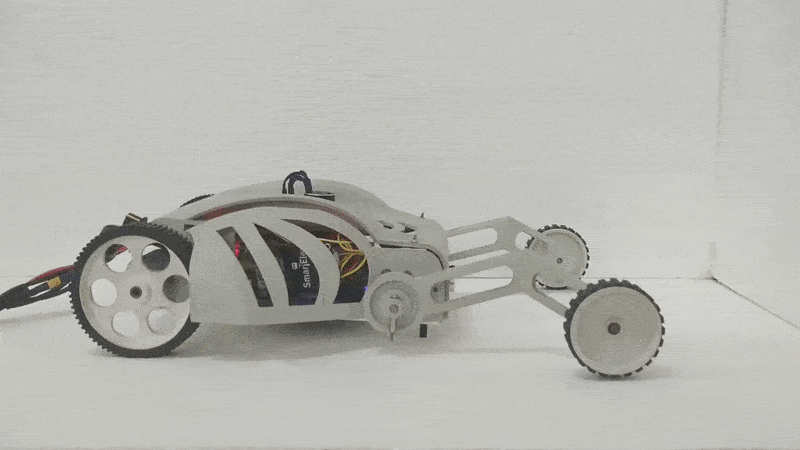
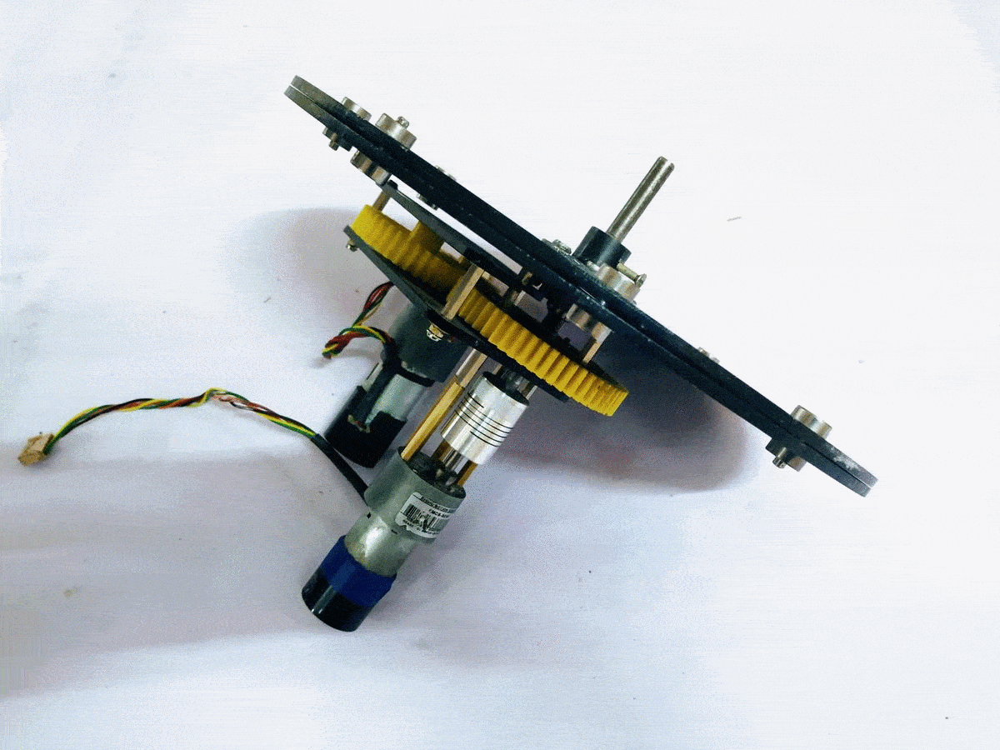
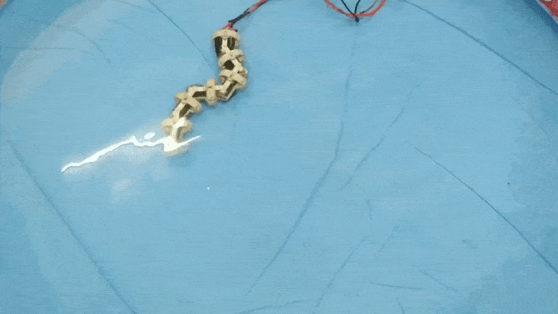

|  **Homebrew Bionics**: (*Under Development*) The project explores various design approaches to lower-limb prosthesis and proposes a low-cost, rapidly fabricable prosthetic solution with economic, indigenous materials and a culture-specific design for developing countries.

| {:target="blank"} **Ibex**: a unique unmanned ground vehicle with a dynamic wheelbase and an adaptive thrust based friction optimization scheme that aids in the traversal of steep slopes and slippery surfaces. The vehicle is capable of adapting itself to the surface topography using an impedance-based stabilization module to minimize the mechanical oscillatory transients induced during its motion.| [{:width="250px"}](https://github.com/spider-tronix/armadillo){:target="blank"} **Armadillo**: Design and control of a wheel capable of varying its radius over a range of values using a novel transformation mechanism. The transformation occurs without any additional actuators which enhances its maneuverability.|  

{:target="blank"} **Arboc**: The project focuses on modelling the dynamics of underwater robots and to simulate, validate and develop a biomimetic snake-robot which is robust enough to carry out underwater exploratory tasks.